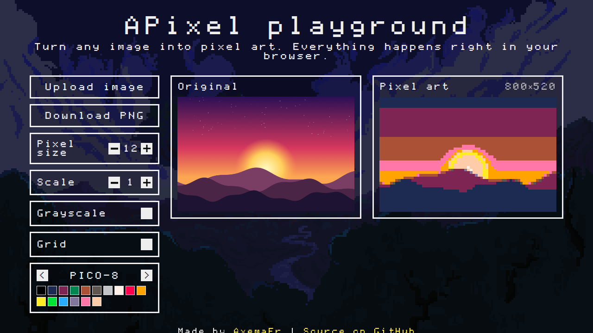

# APixel

[](https://github.com/AxemaFr/APixel/actions/workflows/ci.yml)

Turn any image into pixel art right in your browser. Nothing is uploaded anywhere: all the processing happens locally on a `<canvas>`.

**[Live demo →](https://axemafr.github.io/APixel/)**



## Features

- **Upload, drag & drop or paste** an image from the clipboard
- **Pixel size** — how many source pixels become one "big" pixel
- **Scale** — size of the result relative to the original (from 0.1× to 2×)
- **Palettes** — keep the original colors or snap them to a classic palette: PICO-8, Game Boy, CGA, 1-bit and more
- **Grayscale** and **grid** (LED-screen look) modes
- **Download** the result as a PNG
- Transparent images stay transparent

## How it works

The algorithm lives in [`src/app/core/pixelator.ts`](src/app/core/pixelator.ts) and is framework-agnostic:

1. The image is split into `pixelSize × pixelSize` blocks (the ones on the right and bottom edges are cropped to the image).
2. Every block is averaged into a single color. Pixels are weighted by their alpha, so transparent areas don't darken the result, and mostly transparent blocks are left empty.
3. If a palette is selected, the color is replaced with the nearest palette color using the ["redmean"](https://www.compuphase.com/cmetric.htm) distance, which is closer to human perception than plain RGB distance.
4. Optionally the color is converted to grayscale using luma (`0.299 R + 0.587 G + 0.114 B`).
5. Blocks are painted onto the output canvas.

Images larger than 2048 px are downscaled on load to keep everything fast.

## Getting started

You need [Node.js](https://nodejs.org/) 20.19+, 22.12+ or 24+.

```bash
npm install
npm start
```

Then open http://localhost:4200/.

| Command                | Description                             |
| ---------------------- | --------------------------------------- |
| `npm start`            | Start the dev server with live reload   |
| `npm run build`        | Build for production into `dist/apixel` |
| `npm test`             | Run unit tests (Vitest)                 |
| `npm run lint`         | Lint TypeScript and templates (ESLint)  |
| `npm run format`       | Format the code with Prettier           |
| `npm run format:check` | Check the formatting                    |

## Project structure

```
src/app
├── app.component.*          # The playground: state, canvases, upload/download
├── components/              # Pixel-styled UI kit
│   ├── button/
│   ├── checkbox/
│   ├── incrementer/
│   ├── palette/
│   └── uploader/
└── core/
    ├── pixelator.ts         # The pixelation algorithm
    ├── palettes.ts          # Built-in color palettes
    └── image-loader.ts      # File → ImageData
```

Built with [Angular](https://angular.dev/) 21 (standalone components, signals, zoneless change detection).

## Deployment

Every push to `main` is deployed to GitHub Pages by [`.github/workflows/deploy.yml`](.github/workflows/deploy.yml).
To enable it once, go to **Settings → Pages → Build and deployment** and set **Source** to **GitHub Actions**.
